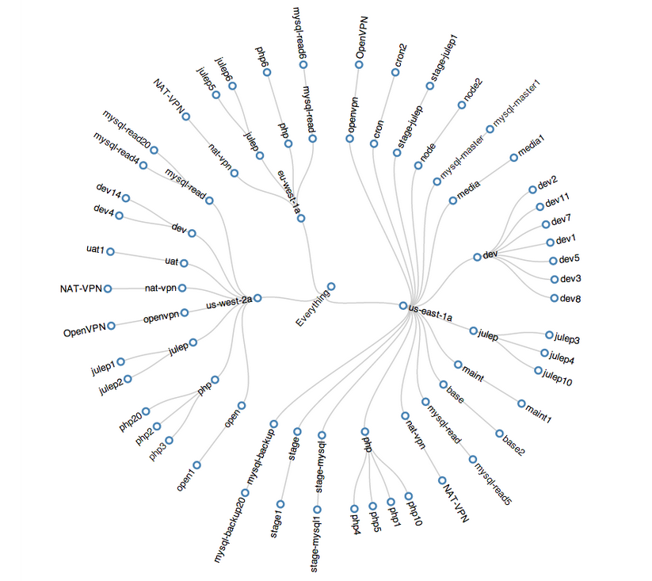

awsviz
========

This is just a simple project example that generates a visual output of real time AWS Instances and Regions. It makes asynchronous API calls to all of the AWS endpoints and then renders the json output of that into one of the example d3 visualizations.

Example Output:

